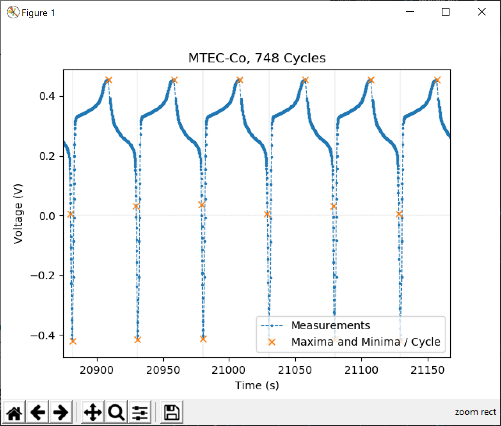
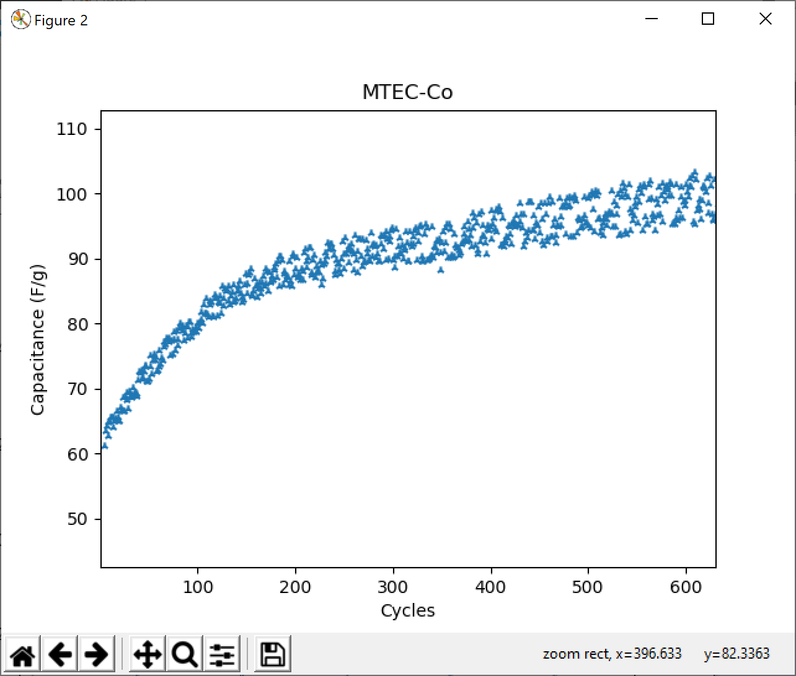

# What's This?

This is about the analysis of data yielded by different type of machines running a cyclic voltammetry experiment.
The data interface of such machines is mostly a comma separated values (*.csv or *.txt) file.
A file consisting of 1000 cycles can have a size between 25 and 50MB.

The file format is always a timetamp followed by its value. Sequential.

## Malee

Is the name of the python script I wrote for my significant other.
She is researching on electrochemical energy storages at Kasetsart University in Bangkok.

Every time she has completed manufacturing the materials possibly being used in future supercapacitors, she needs to analyze their capacitance.
The script is hopefully self-explanatory and generates the following interactive charts:

